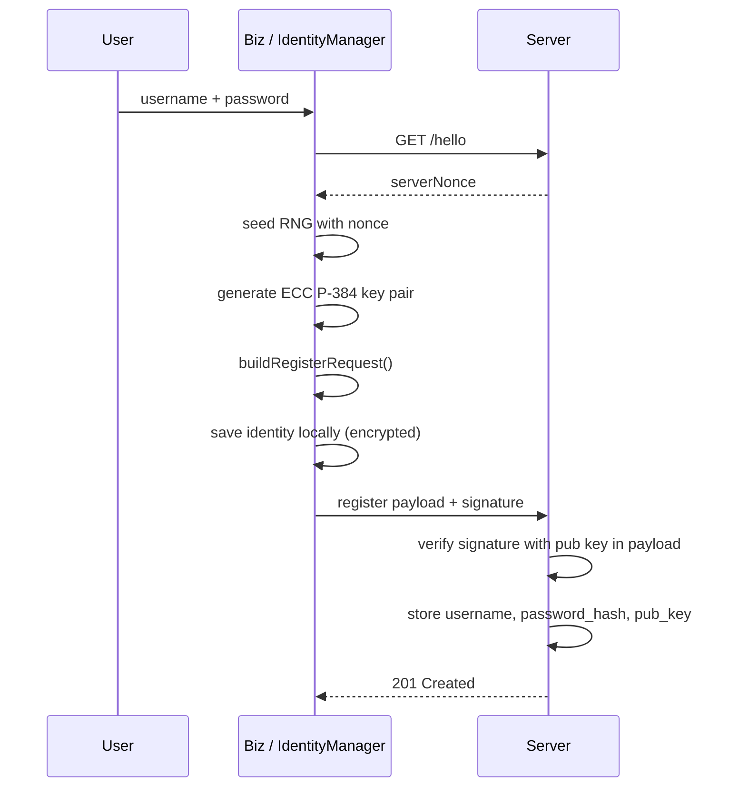
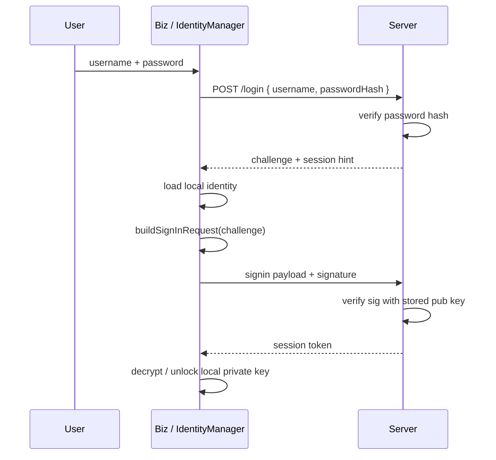
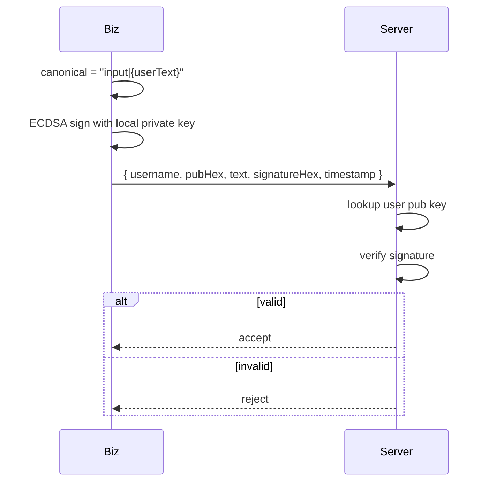

# 04 — Authentication & Identity Flows

End-to-end flows for **user registration**, **login**, and **signed user actions**, based on [discussion_02.md](./discussion_02.md). Runnable code: [examples/IdentityManager.js](./examples/IdentityManager.js).

---

## Design rules

1. Generate the **ECC key pair once** at registration — not on every login.
2. **Upload public key only** to the server; private key never leaves the device.
3. After login, authenticate actions with **signatures**, not repeated passwords.
4. Server stores `username + password_hash + public_key` — never the private key.
5. Use a **canonical string** for signing so client and server hash the same bytes.
6. **`signUserInput` requires an unlocked session** — call `signIn()` (or `unlockSession()`) first so the private key is in memory; it is not read from disk on every action.

---

## Registration flow



### Client steps

```javascript
IdentityManager.init();

// 1. Server hello (store nonce, seed RNG)
IdentityManager.onServerHello(serverNonceHex);

// 2. Register
var result = IdentityManager.register("alice", "secret123");
// result.request → send to server
// result.record  → saved locally (privEnc only, no plaintext privHex)
sendToServer(result.request);
```

### Register payload (JSON)

```json
{
  "action": "register",
  "username": "alice",
  "passwordHash": "sha256hex_of_username_pipe_password",
  "pubHex": "04...",
  "curve": "secp384r1",
  "timestamp": 1750000000000,
  "serverNonce": "abc123...",
  "signatureHex": "304..."
}
```

### Canonical sign string

Pipe-separated, fixed field order:

```text
register|{username}|{passwordHash}|{pubHex}|{timestamp}|{serverNonce}
```

Client signs with **new** private key. Server verifies with **pubHex in the same request** (proves caller owns the private key).

### Server verification (pseudocode)

```javascript
if (!IdentityManager.verifyRegisterRequest(req)) reject();
if (userExists(req.username)) reject();
saveUser(req.username, req.passwordHash, req.pubHex, req.curve);
```

Runnable server module: [examples/ServerAuth.js](./examples/ServerAuth.js)  
Step-by-step Node walkthrough: [examples/example-server-verify.js](./examples/example-server-verify.js)  
Full guide: [07-beginner-crypto-walkthrough.md](./07-beginner-crypto-walkthrough.md) Part 11

---

## Login flow



Password proves account ownership to the server **once**. The sign-in signature proves **device key possession**.

### Sign-in payload

```json
{
  "action": "signin",
  "username": "alice",
  "pubHex": "04...",
  "serverChallenge": "challenge99",
  "timestamp": 1750000001000,
  "serverNonce": "nonce88",
  "signatureHex": "304..."
}
```

### Canonical sign string

```text
signin|{username}|{serverChallenge}|{timestamp}|{serverNonce}
```

---

## Signed user action flow

After login, sign biz actions (chat, commands, trades):



### Example packet

```json
{
  "username": "alice",
  "pubHex": "04...",
  "curve": "secp384r1",
  "text": "move north",
  "signatureHex": "304...",
  "timestamp": 1750000002000
}
```

Canonical string: `input|move north`

```javascript
// After successful signIn (session is unlocked automatically)
var packet = IdentityManager.signUserInput("alice", "move north");
sendToServer(packet);

// Server:
IdentityManager.verifySignedInput(packet); // true/false

// On logout:
IdentityManager.clearSession();
```

---

## Server-side verification checklist

For every signed request:

1. Parse JSON; reject malformed payloads.
2. Look up user by `username` (or `keyId`).
3. Load stored `pubHex` — **compare** with payload `pubHex` (must match).
4. Rebuild canonical string with **exact** same rules as client.
5. `CryptoManager.verifyECC(canonical, signatureHex, pubKeyHandle)`.
6. Check `timestamp` within allowed skew (replay protection).
7. Check `serverNonce` / challenge not reused (store spent nonces).

No password required on signed requests.

---

## Local private key protection

At registration:

```text
password → derive key material → encrypt privHex / PEM → localStorage
```

Minimal approach (included in IdentityManager):

```javascript
// Stored record (production — password-protected)
{
  "version": 1,
  "username": "alice",
  "pubHex": "04...",
  "curve": "secp384r1",
  "privEnc": "encrypted_hex...",
  "keyId": "sha384_fingerprint...",
  "createdAt": 1750000000000
}
```

Plaintext `privHex` is stored **only** when `identityToRecord` is called without a password (dev/test). Production registration always passes the password and stores `privEnc` only.

---

## Error codes (recommended SDK surface)

| Code | Meaning |
|------|---------|
| `CRYPTO_NOT_INITIALIZED` | Forgot `CryptoManager.initialize()` |
| `KEYGEN_FAILED` | Entropy / key generation error |
| `NO_LOCAL_IDENTITY` | Login/sign without registered user |
| `SIGN_FAILED` | Signing error |
| `VERIFY_FAILED` | Signature invalid |
| `STORAGE_FAILED` | localStorage write failed |

---

## What not to do

| Anti-pattern | Why |
|--------------|-----|
| New RSA/EC key every login | Server cannot correlate identity |
| Send password with each action | Credential theft risk |
| `SHA256(password)` only on server | Rainbow tables |
| Sign JSON object directly | Field order differs across parsers — use canonical string |
| Log `privHex` or PEM | Key compromise |

---

## Example scene integration

See [examples/example-https-biz.js](./examples/example-https-biz.js) for the **full HTTPS + crypto** flow, or [examples/example-auth-biz.js](./examples/example-auth-biz.js) for crypto-only patterns.

HTTPS guide: [06-https-networking.md](./06-https-networking.md)

---

## Next

- [05-algorithms-and-security.md](./05-algorithms-and-security.md)
- Run smoke test: `node jsrsasign/docs/examples/test-smoke.js`
